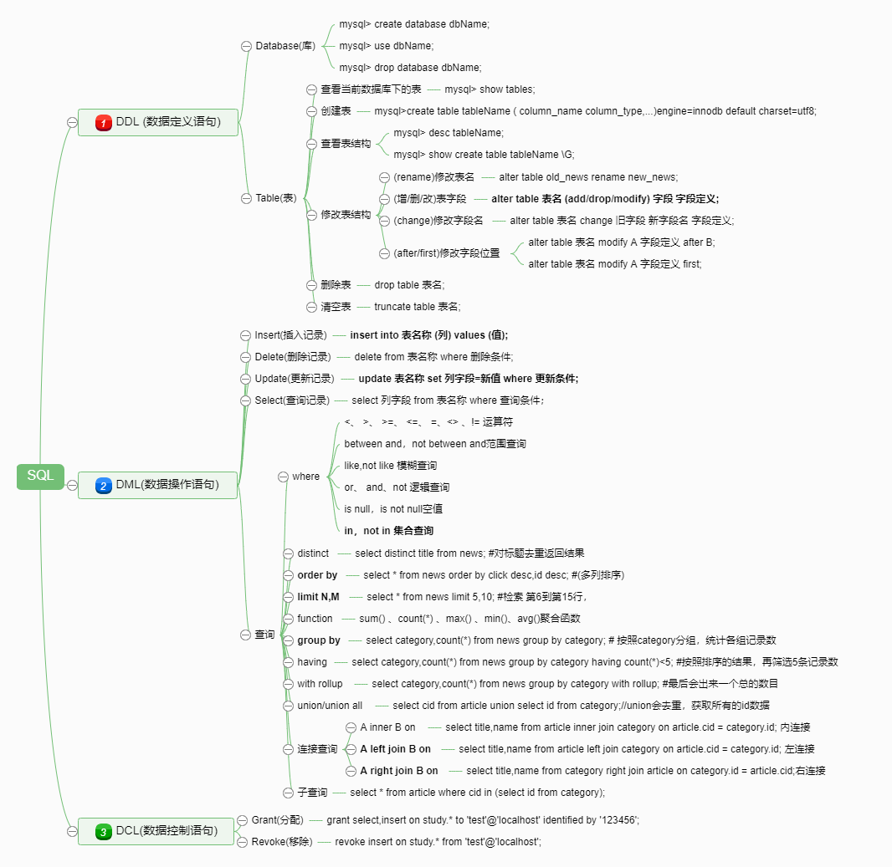

# 2 表的增删改查sql

> &emsp;&emsp; **增删改查** 基本上大多数程序都会设计到增删改查，只不过是表现形式上可能略有不同，有的存储数据是用MySQL，或者有些用缓存redis，看其操作，都会有增删改查的过程。例如我们在一个网站注册用户的时候，就会涉及到新增数据；在登录网站的时候，就会涉及到查询操作。等等这样的例子有很多。接下来，我们首先明确如何去建立一张表，然后来看看我们可以如何操作这些数据，从而来满足你的需求📜。

***
<p align="right">-***Tacks [^NAME]***</p>
[^NAME]: This is my Sign! My name is `Tao A`, email is `tacks321@qq.com` <br/>
If you find any mistakes , you can contact me!

<p align="right"><sup>2019/09/29 Sunday</sup></p>

## 目录
<!-- MarkdownTOC autolink="true" autoanchor="true" -->

- [1 什么是SQL](#1-%E4%BB%80%E4%B9%88%E6%98%AFsql)
    - [1.1 概念](#11-%E6%A6%82%E5%BF%B5)
    - [1.2 示例](#12-%E7%A4%BA%E4%BE%8B)
- [2. 首先你要有一个数据库](#2-%E9%A6%96%E5%85%88%E4%BD%A0%E8%A6%81%E6%9C%89%E4%B8%80%E4%B8%AA%E6%95%B0%E6%8D%AE%E5%BA%93)
    - [查看当前数据库整体状态](#%E6%9F%A5%E7%9C%8B%E5%BD%93%E5%89%8D%E6%95%B0%E6%8D%AE%E5%BA%93%E6%95%B4%E4%BD%93%E7%8A%B6%E6%80%81)
    - [2.1 创建数据库](#21-%E5%88%9B%E5%BB%BA%E6%95%B0%E6%8D%AE%E5%BA%93)
    - [2.2 选择数据库](#22-%E9%80%89%E6%8B%A9%E6%95%B0%E6%8D%AE%E5%BA%93)
    - [2.3 修改数据库名称](#23-%E4%BF%AE%E6%94%B9%E6%95%B0%E6%8D%AE%E5%BA%93%E5%90%8D%E7%A7%B0)
    - [2.4 删除数据库](#24-%E5%88%A0%E9%99%A4%E6%95%B0%E6%8D%AE%E5%BA%93)
- [3. 创建你想要的数据表 \(使用DDL语句\)](#3-%E5%88%9B%E5%BB%BA%E4%BD%A0%E6%83%B3%E8%A6%81%E7%9A%84%E6%95%B0%E6%8D%AE%E8%A1%A8-%E4%BD%BF%E7%94%A8ddl%E8%AF%AD%E5%8F%A5)
    - [3.1 创建表 `(create table)`](#31-%E5%88%9B%E5%BB%BA%E8%A1%A8-create-table)
    - [3.2 查看表结构 `(show table)`](#32-%E6%9F%A5%E7%9C%8B%E8%A1%A8%E7%BB%93%E6%9E%84-show-table)
    - [3.3 修改表结构  `(alter table)`](#33-%E4%BF%AE%E6%94%B9%E8%A1%A8%E7%BB%93%E6%9E%84-alter-table)
    - [3.4 删除表  `(drop table)`](#34-%E5%88%A0%E9%99%A4%E8%A1%A8-drop-table)
- [4. 数据的增删改查 \(使用DML语句\)](#4-%E6%95%B0%E6%8D%AE%E7%9A%84%E5%A2%9E%E5%88%A0%E6%94%B9%E6%9F%A5-%E4%BD%BF%E7%94%A8dml%E8%AF%AD%E5%8F%A5)
    - [4.1 新增数据 `insert`](#41-%E6%96%B0%E5%A2%9E%E6%95%B0%E6%8D%AE-insert)
    - [4.2 删除数据 `delete`](#42-%E5%88%A0%E9%99%A4%E6%95%B0%E6%8D%AE-delete)
    - [4.3 更新数据 `update`](#43-%E6%9B%B4%E6%96%B0%E6%95%B0%E6%8D%AE-update)
    - [4.4 查询数据 `select`](#44-%E6%9F%A5%E8%AF%A2%E6%95%B0%E6%8D%AE-select)
    - [4.5 查询详解](#45-%E6%9F%A5%E8%AF%A2%E8%AF%A6%E8%A7%A3)
- [5.数据库权限问题\(使用DCL语句\) 了解即可](#5%E6%95%B0%E6%8D%AE%E5%BA%93%E6%9D%83%E9%99%90%E9%97%AE%E9%A2%98%E4%BD%BF%E7%94%A8dcl%E8%AF%AD%E5%8F%A5-%E4%BA%86%E8%A7%A3%E5%8D%B3%E5%8F%AF)
- [6.打个总结](#6%E6%89%93%E4%B8%AA%E6%80%BB%E7%BB%93)

<!-- /MarkdownTOC -->


<a id="1-%E4%BB%80%E4%B9%88%E6%98%AFsql"></a>
### 1 什么是SQL

<a id="11-%E6%A6%82%E5%BF%B5"></a>
#### 1.1 概念
&emsp;&emsp;**SQL**(Structure Query Language)**结构化查询语句**，由IBM在20世纪70年代中开发出来。作为关系型数据库信息检索。

主要分为下面三种

- **DDL** 数据定义语句(Data Definition Language)   创建数据库 表 索引 视图 等操作 `create` `drop` `alter`
- **DML** 数据操作语句(Data Manipulation Language) 数据的增删改查    `insert` `delete` `update` `select`
- **DCL** 数据控制语句(Data Control language)      用户权限 安全级别 `grant` `revoke`

<a id="12-%E7%A4%BA%E4%BE%8B"></a>
#### 1.2 示例
我们在执行SQL后，都会有一个返回结果，通常是由三部分组成。
```mysql
    mysql> create database dbname;
    Query OK, 1 row affected (0.00 sec)
```
结果分析：

- ①Query OK       这个是一个执行成功的返回
- ②1 row affected 这个是一个影响的记录或者行数
- ③0.00 sec       这个是操作的执行时间


<a id="2-%E9%A6%96%E5%85%88%E4%BD%A0%E8%A6%81%E6%9C%89%E4%B8%80%E4%B8%AA%E6%95%B0%E6%8D%AE%E5%BA%93"></a>
### 2. 首先你要有一个数据库

<a id="%E6%9F%A5%E7%9C%8B%E5%BD%93%E5%89%8D%E6%95%B0%E6%8D%AE%E5%BA%93%E6%95%B4%E4%BD%93%E7%8A%B6%E6%80%81"></a>
#### 查看当前数据库整体状态

**格式：** `mysql> status;`


```mysql
mysql> use study;
Database changed

mysql> status
--------------
mysql  Ver 14.14 Distrib 5.7.26, for Linux (x86_64) using  EditLine wrapper

Connection id:          19704           `【连接ID 每个客户端都不一样】`
Current database:       study           `【当前选的数据库】`
Current user:           root@Localhost  `【登录的用户】`
SSL:                    Not in use      `【安全套接字层 基于tcp提供安全保证】`
Current pager:          stdout          `【标准输出】`
Using outfile:          ''              `【导出的文本中】`
Using delimiter:        ;               `【结尾分界符】`
Server version:         5.7.26 MySQL Community Server (GPL) `【版本】`
Protocol version:       10              `【协议版本】`
Connection:             Localhost via UNIX socket `【连接方式，使用的socket套接字 或者可以TCP连接】`
Server characterset:    latin1`【服务器默认字符集】`
Db     characterset:    utf8  `【数据库默认字符集】`
Client characterset:    utf8  `【客户端默认字符集】`
Conn.  characterset:    utf8  `【连接端默认字符集】`
UNIX socket:            /var/lib/mysql/mysql.sock    `【套接字文件位置】`
Uptime:                 26 days 19 hours 19 min 5 sec`【服务器运行时间】`

Threads: 3          `【当前的连接的线程个数】`
Questions: 30009123 `【已经发送给服务器的查询的个数 = Com_* + Qcache_hits】`
Slow queries: 0     `【慢查询的语句个数】`
Opens: 682          `【已经打开的表的数量】`
Flush tables: 1     `【执行flush tables的次数】`
Open tables: 513    `【当前打开的表的数量，可以通过flush tables将数据写入磁盘】`
Queries per second avg: 12.957 `【从上次运行开始计算，每秒钟平均查询次数】`
`具体的一些参数细节，之后再总结。`
--------------

```

<a id="21-%E5%88%9B%E5%BB%BA%E6%95%B0%E6%8D%AE%E5%BA%93"></a>
#### 2.1 创建数据库

**格式:** `create database 数据库名称;`

首先保证你的`mysqld`的服务要运行起来，然后通过`mysql -uroot -p` 进入客户端，当然你也可以用图形化的工具。


- 创建一个名字为dbname的数据库。这种是最简单的写法,也是**必须要会**的。

    `mysql> create database dbname;`

- 如果dbname**不存在(`if not exists`)**才创建这个数据库，设置默认字符集utf8和默认比较规则utf8，比较不区分大小写，这种比较全面。

    `mysql> create database if not exists dbname default charset utf8 collate utf8_general_ci;`

- 另外如果你在linux命令行中，只想执行一条sql,那么你可以这样，直接执行，不过一般很少这样做。

    `$ mysqladmin -uroot -p create dbname`

**示例**
```
    mysql> create database dbname;
    Query OK, 1 row affected (0.00 sec)

    mysql> create database if not exists dbname default charset utf8 collate utf8_general_ci;
    Query OK, 1 row affected, 1 warning (0.00 sec)

    mysql> show warnings;
    +-------+------+-------------------------------------------------+
    | Level | Code | Message                                         |
    +-------+------+-------------------------------------------------+
    | Note  | 1007 | Can't create database 'dbname'; database exists |
    +-------+------+-------------------------------------------------+
    1 row in set (0.00 sec)
```
<a id="22-%E9%80%89%E6%8B%A9%E6%95%B0%E6%8D%AE%E5%BA%93"></a>
#### 2.2 选择数据库

**格式:** `use 数据库名`

- 只有选择了数据库，才可以对数据库，进行进一步操作。
    `use dbname`

**示例:**
```mysql
    mysql> use dbname;
    Database changed
```

<a id="23-%E4%BF%AE%E6%94%B9%E6%95%B0%E6%8D%AE%E5%BA%93%E5%90%8D%E7%A7%B0"></a>
#### 2.3 修改数据库名称

&emsp;&emsp;一般如果创建好了数据库，就不会再轻易换名字了，因为没有直接的语句来执行，而且比较容易出现数据出错。另外有些人可能会说用rename命令，但是这个命令不能用于修改数据库，只能改表名字。最最保险的方法，**先将旧数据库的所有数据表导出来，然后再导入新建的数据库中。删除旧数据库。**

<a id="24-%E5%88%A0%E9%99%A4%E6%95%B0%E6%8D%AE%E5%BA%93"></a>
#### 2.4 删除数据库

**格式:** `drop database 数据库名称;`

- 删除一个名字为dbname的数据库
    `mysql> drop database dbname;`
- 利用mysqladmin删除一个数据库
    `$ mysqladmin -uroot -p drop dbname`

**示例**
```mysql
    mysql> drop database dbname;
    Query OK, 0 rows affected (0.04 sec)
```

<a id="3-%E5%88%9B%E5%BB%BA%E4%BD%A0%E6%83%B3%E8%A6%81%E7%9A%84%E6%95%B0%E6%8D%AE%E8%A1%A8-%E4%BD%BF%E7%94%A8ddl%E8%AF%AD%E5%8F%A5"></a>
### 3. 创建你想要的数据表 (使用DDL语句)

常用： `mysql> show tables;` 查看当前数据库下有什么表


<a id="31-%E5%88%9B%E5%BB%BA%E8%A1%A8-create-table"></a>
#### 3.1 创建表 `(create table)`

1. 首先选择你想要再哪个数据库下创建表 `use dbname;`
2. 想要你想要的关系表，有哪些字段而且是什么类型的，结合之前我们分析的数据类型，以及存储引擎，索引，字符集等。

**通用格式**
```
    create table table_name (
        column_name column_type,
        ...
        column_namen column_type
    )engine=innodb default charset=utf8;
```

**示例**
```mysql
    create table if not exists news (
      id        int(10) unsigned NOT NULL AUTO_INCREMENT    COMMENT '视频id',
      title     varchar(100)     NOT NULL DEFAULT ''        COMMENT '新闻公告标题',
      content   text             NOT NULL                   COMMENT '正文内容',
      click     int(10) unsigned NOT NULL DEFAULT '0'       COMMENT '点击量',
      display   tinyint(1)       NOT NULL DEFAULT '0'       COMMENT '是否显示1/0',
      subtime   datetime         NOT NULL DEFAULT '2020-01-01 00:00:00' COMMENT '创建时间',
      PRIMARY KEY (id)
    ) engine=InnoDB  default charset=utf8 comment='新闻表';
```

说明：
字段中必须指定的内容是  **字段名 字段类型**  其他选项如果不指定则会默认值。

- `unsigned`
    - 如果是**非负数**，可以利用`unsigned`关键字指定该字段，同时这样取值范围是正数范围扩大，
    - 默认：如果没有指定，则表示 从负数到正数 ，例如 `tinyint` 的范围(-128~127) => 使用关键字后 =>(0~256)
- `not null`
    - 如果该字段，必须要有值可以设置`not null`，如果插入数据的时候为空，则插入失败。
    - 默认：如果没有指定，则表示可以插入空值也就是NULL。
- `default`
    - 如果设置非空，可以设置默认值。text blob 不能设置默认值。
    - 如果没有设置默认值
- `auto_increment`
    - **唯一扩展的完整性约束** 定义列为**自增**的属性，数值会自动加1。
    - 一个表中只能有一个字段使用该约束，并且该字段的数据类型必须为 **整数类型**，**该字段有唯一索引**，一般用于**主键**(可以不是主键)。
    - 一个`NULL`插入到一个`AUTO_INCREMENT`数据列里去，MYSQL将自动生成下一个序列编号。插入0效果一样。
    - 如果指定了该列的值，有两种情况，一种是会与表中其他数据id重复，报错； 一种是插入成功，可能跳过了一些id。
- `primary key (id)`
    - 关键字用于定义列为**主键**。 当然可以使用多个字段来定义主键，列间以逗号分隔。一般我们就用id一个字段。
    - **主键必须唯一； 主键不能包含NULL; 一个表只能由一个主键；**
    - 主键索引通常在建表的时候就指定，同时使用`auto_increment`
- `comment`
    - 描述列的意义 , 不影响数据存储，只是开发人员显示友好，建议加上。
- `engine`
    - 指定**表的引擎**例如innodb myisam等
- `default`
    - 设置默认字符串编码的字符集一般选择`utf8`


<a id="32-%E6%9F%A5%E7%9C%8B%E8%A1%A8%E7%BB%93%E6%9E%84-show-table"></a>
#### 3.2 查看表结构 `(show table)`

当我们把表建立好后，可能后期还是需要看当时表的创建语句，我们需要下面的命令。

- `mysql> desc 表名;`         (查看表的字段)
- `show create table 表名;`   (查看建表语句)
- `show create table 表名 \G;`(竖向排列显示，更紧凑)

**示例**
```mysql
    mysql> desc news;
    +---------+------------------+------+-----+---------------------+----------------+
    | Field   | Type             | Null | Key | Default             | Extra          |
    +---------+------------------+------+-----+---------------------+----------------+
    | id      | int(10) unsigned | NO   | PRI | NULL                | auto_increment |
    | title   | varchar(100)     | NO   |     |                     |                |
    | content | text             | NO   |     | NULL                |                |
    | click   | int(10) unsigned | NO   |     | 0                   |                |
    | display | tinyint(1)       | NO   |     | 0                   |                |
    | subtime | datetime         | NO   |     | 2020-01-01 00:00:00 |                |
    +---------+------------------+------+-----+---------------------+----------------+


    mysql> show create table news \G;
    *************************** 1. row ***************************
           Table: news
    Create Table: CREATE TABLE `news` (
      `id` int(10) unsigned NOT NULL AUTO_INCREMENT COMMENT '视频id',
      `title` varchar(100) NOT NULL DEFAULT '' COMMENT '新闻公告标题',
      `content` text NOT NULL COMMENT '正文内容',
      `click` int(10) unsigned NOT NULL DEFAULT '0' COMMENT '点击量',
      `display` tinyint(1) NOT NULL DEFAULT '0' COMMENT '是否显示1/0',
      `subtime` datetime NOT NULL DEFAULT '2020-01-01 00:00:00' COMMENT '创建时间',
      PRIMARY KEY (`id`)
    ) ENGINE=InnoDB DEFAULT CHARSET=utf8 COMMENT='新闻表'
    1 row in set (0.00 sec)
```

<a id="33-%E4%BF%AE%E6%94%B9%E8%A1%A8%E7%BB%93%E6%9E%84-alter-table"></a>
#### 3.3 修改表结构  `(alter table)`

可能当你后期需要给表添加新的字段的时候，或者其他要改动，可以用到`alter`来进行修改表的结构，大致有以下几种情况。

- `alter table 表名 rename 新的表名;`                修改新的表名
- `alter table 表名 (add/drop/modify) 字段 字段定义;`增加或者删除或者修改 表字段
- `alter table 表名 change 旧字段 新字段名 字段定义;` 修改字段名
- `alter table 表名 modify A 字段定义 after B;`      修改字段A的移动到B后面
- `alter table 表名 modify A 字段定义 first;`        把该修改字段A放到最前面

**示例**

- 改表名：
    - `mysql> alter table news rename my_news;`
- 新增列：
    - `mysql> alter table my_news add uptime datetime not null default '2020-01-01 00:00:00' comment '更新时间';`
- 改列名：
    - `mysql> alter table my_news change subtime createtime  datetime not null default '2020-01-01 00:00:00' comment '创建时间';`
- 修改列：
    - `mysql> alter table my_news modify display smallint comment '显示状态' after content;`（同时修改字段顺序在content后面）

**注意**

1. modify与change 都可以修改表的定义，但是change可以修改列的名称，modify不能
2. 增加表的字段利用`add column`   后面都需要跟上定义列的内容
3. 删除表的字段利用`drop column`  删除列定义
4. 修改表的字段利用`modify column` 后面都要跟上定义列的内容
5. 在修改表的字段 使用`after` 或者 `first` 可以修改列的顺序


```MySQL
mysql> alter table news rename my_news;
Query OK, 0 rows affected (0.05 sec)

mysql> show tables;
+------------------+
| Tables_in_dbname |
+------------------+
| my_news          |
+------------------+

mysql> alter table my_news add uptime datetime not null default '2020-01-01 00:00:00' comment '更新时间';
Query OK, 0 rows affected (0.16 sec)
Records: 0  Duplicates: 0  Warnings: 0

mysql> alter table my_news change subtime createtime datetime not null default '2020-01-01 00:00:00';
Query OK, 0 rows affected (0.04 sec)
Records: 0  Duplicates: 0  Warnings: 0

mysql> alter table my_news modify display smallint comment '显示状态' after content;
Query OK, 0 rows affected (0.18 sec)
Records: 0  Duplicates: 0  Warnings: 0

mysql> desc my_news;
+------------+------------------+------+-----+---------------------+----------------+
| Field      | Type             | Null | Key | Default             | Extra          |
+------------+------------------+------+-----+---------------------+----------------+
| id         | int(10) unsigned | NO   | PRI | NULL                | auto_increment |
| title      | varchar(100)     | NO   |     |                     |                |
| content    | text             | NO   |     | NULL                |                |
| display    | smallint(6)      | YES  |     | NULL                |                |
| click      | int(10) unsigned | NO   |     | 0                   |                |
| createtime | datetime         | NO   |     | 2020-01-01 00:00:00 |                |
| uptime     | datetime         | NO   |     | 2020-01-01 00:00:00 |                |
+------------+------------------+------+-----+---------------------+----------------+
```

<a id="34-%E5%88%A0%E9%99%A4%E8%A1%A8-drop-table"></a>
#### 3.4 删除表  `(drop table)`

- `drop table 表名`  删除表定义及其数据(用于不再需要这个表的时候)  `删除表结构和数据`
- `truncate table 表名` 只能删除表所有的记录，不能回滚，不会触发表的删除，执行速度很快。 `删除表的数据`


<a id="4-%E6%95%B0%E6%8D%AE%E7%9A%84%E5%A2%9E%E5%88%A0%E6%94%B9%E6%9F%A5-%E4%BD%BF%E7%94%A8dml%E8%AF%AD%E5%8F%A5"></a>
### 4. 数据的增删改查 (使用DML语句)

先看一下news的表结构
```
    mysql> desc news;
+----------+------------------------------+------+-----+---------+----------------+
| Field    | Type                         | Null | Key | Default | Extra          |
+----------+------------------------------+------+-----+---------+----------------+
| id       | int(5)                       | NO   | PRI | NULL    |                |
| title    | varchar(100)                 | NO   |     |         |                |
| category | char(12)                     | YES  |     | NULL    |                |
| content  | text                         | YES  |     | NULL    |                |
| click    | tinyint(8) unsigned zerofill | YES  |     | NULL    |                |
| display  | tinyint(1)                   | NO   |     | 0       |                |
| status   | int(5)                       | NO   | UNI | NULL    | auto_increment |
| subtime  | datetime                     | YES  |     | NULL    |                |
+----------+------------------------------+------+-----+---------+----------------+
```
**格式**【DML】 数据操作语句

- 增
    `insert into 表名称   (列)  values (值);`
- 删
    `delete from 表名称 where  删除条件;`
- 改
    `update 表名称 set 列字段=新值 where  更新条件;`
- 查
    `select 列字段 from 表名称 where  查询条件；`

<a id="41-%E6%96%B0%E5%A2%9E%E6%95%B0%E6%8D%AE-insert"></a>
#### 4.1 新增数据 `insert`

`insert into`  语句用于向表中插入新记录。

**插入多条数据**
```mysql
        insert into table_name
            ( field1,field2 , ... ,fieldn )
            values
            ( value1,value2 , ..., valuen ),
            ( value1,value2 , ..., valuen ),
            ( value1,value2 , ..., valuen );
```
**注意**

- 添加数据的时候，按照全部字段的顺序来，那么就不用写字段名，直接插入。
- 添加过主键id自增（`primary key auto_increment`）第一列在增加数据的时候，可以写为0或者null，会自动增加id   <br/>
 `insert into news values (NULL,'第一个','红红火火恍恍惚惚',1,1,'20190907');` 一般插入null
- 如果插入多条记录，可以使用逗号，分开。这个特性可以在插入大量记录时候, 节省很多网络开销，大大提高插入效率。


<a id="42-%E5%88%A0%E9%99%A4%E6%95%B0%E6%8D%AE-delete"></a>
#### 4.2 删除数据 `delete`

`delete` 语句用于删除表中的记录。

**格式**`delete from table_name [where 条件];`

**注意**

- 删除操作比较危险，**一定要记得加上where条件**，否则整个表的数据都会被删除
- `delete` 删除只是数据，结构不变。
    - delete from table_name : 删除表全部数据，对于 MyISAM 会立刻释放磁盘空间，InnoDB 不会释放磁盘空间;
    - delete from table_name where xxx : 带条件的删除，不管是 innodb 还是 MyISAM 都不会释放磁盘空间;
    - delete 操作以后，使用 **optimize table table_name** 会立刻释放磁盘空间，不管是 innodb 还是 myisam;
- 区别： `delete` 、 `truncate` 、`drop`
    - delete 和 truncate 仅仅删除表数据，drop 连表数据和表结构一起删除
    - delete 是 DML 数据操作语句，操作完以后如果没有不想提交事务还可以回滚
    - truncate 和 drop 是 DDL 数据定义语句，操作完马上生效，不能回滚
    - 在速度上，一般来说，drop > truncate > delete。

<a id="43-%E6%9B%B4%E6%96%B0%E6%95%B0%E6%8D%AE-update"></a>
#### 4.3 更新数据 `update`

`update` 语句用于更新表中的记录。

**格式**
    `update table_name set field1=new_value1, field2=new_value2  [where 条件];`

**注意**

- 注意**一定要加上`where`条件** 否则修改的是全部的记录。  `update news set click=2 where id=1`
- 可以同时更新多个字段，用逗号隔开即可。
- 也可以使用字符串函数，替换特定的字符
    `update table_name set field=replace(field, 'old-string', 'new-string');`

<a id="44-%E6%9F%A5%E8%AF%A2%E6%95%B0%E6%8D%AE-select"></a>
#### 4.4 查询数据 `select`

`select` 语句用于从数据库中选取数据。

**格式** `select column_name,column_name2,... from table_name [where 条件];`

**例子**
        查询一下我们刚才插入的数据
```
        mysql> select * from news where id=1;
+----+-----------+--------------------------+-------+---------+---------------------+
| id | title     | content                  | click | display | subtime             |
+----+-----------+--------------------------+-------+---------+---------------------+
|  1 | 第一个    | 红红火火恍恍惚惚         |     1 |       1 | 2019-09-07 00:00:00 |
+----+-----------+--------------------------+-------+---------+---------------------+
        1 row in set (0.00 sec)
```

**注意**

- 我们这里针对一个表进行搜索，所以`from`后面是一个表，当然也支持多表查询 用,逗号隔开表名;
- 利用星号`*`表示查询返回所有字段,当然建议是将字段写出来，优化查询;
- 查询条件`where id=1` 等值判断，还有其他的范围in判断;
- 另外查询这里还有很多东西要讲，分组`group by`、分组后过滤`having`、排序`order by`、筛选`limit`等
- 执行顺序 `select –> where –> group by –> having –> order by -> limit`


<a id="45-%E6%9F%A5%E8%AF%A2%E8%AF%A6%E8%A7%A3"></a>
#### 4.5 查询详解

- [**distinct**] 查询不重复的记录
    + 在表中，一个列可能会包含多个重复值，有时您也许希望仅仅列出不同（`distinct`）的值。
    + `select distinct title from news;` #对标题去重返回结果

- [**where**]    条件查询(or 、and、 <、 >、 >=、 <=、 !=、 =、<>、 in 、not in、 is null 、is not null 、 between等)
    + `select * from news where id>=5 and id<=10;`       #(**逻辑查询 and与**)
    + `select * from news where title="第一个" or category="栏目1"; `#(**逻辑查询 or或**)
    + `select * from news where not id >5 ;` #(**逻辑查询 not非**)
    + `select * from news where id = 1;` #(**等值查询 =**)
    + `select * from news where  category is null;` #(**非空判断 is null**)
    + `select * from news where id between 1 and 5;` #(**范围查询 between**)
    + `select * from news where id in (1,3,5);` #(**列表查询 in**)
    + `select * from news where title like '第一%';` #(**模糊查询 like**) %匹配多个字符  _匹配一个字符

- [**order by**] 用于对结果集进行排序(默认升序asc  也可以倒叙desc)
    + `select * from news order by click desc`;#(**单列排序**)
    + `select * from news order by click desc,id desc;` #(**多列排序**)先按照第一个字段排序，如果一样，按照第二个排序

- [**limit N,M**] 从第N+1行开始，返回M个记录。 在分页功能上会有体现。
    + `select * from news order by click desc limit 5;` #按照排序的结果，再筛选5条记录数 limit 5=>limit 0,5
    + `select * from news limit 5,10;` #检索 第6到第15行

- [**function**] 聚合函数 常用的sum() 、count(*) 、max() 、min()、avg()
    + `select count(*) from news;` #查看news中有多少条记录
    + `select avg(click) from news;` #平均点赞量
    + `select sum(click) from newsl` #总的点赞量

- [**group by**] 分组语句可结合一些聚合函数来使用
    + `select category,count(*) from news group by category;` # 按照category分组，统计各组记录数

- [**having**] 在分组group by后再筛选having
    + 注意，having与where,where是在聚合前就筛选，而having是在聚合后的条件中筛选。
    + 所以我们在使用having的时候，也可以先进行where过滤记录，可以减少结果集，对聚合效率可以提高。
    + `select category,count(*) from news group by category having count(*)<5;` #按照排序的结果，再筛选5条记录数

- [**with rollup**] 先分类聚合，查出每组的情况，然后后面跟上，查出来总的数目  简单来说 就是最后出来一个总的结果数
    + `select category,count(*) from news group by category with rollup;` #最后会出来一个总的数目

- [**union/union all**] 记录联合
    + 有时候我们需要讲查询条件合并在一起显示,需要用到union(这个是所有数据去重后的)或者union all
    + `select cid from article union  select id from category;`//union会去重，获取所有的id数据
- [**join**] 内、外连接
    + 内连接 inner ：两个表 相互匹配的记录，都含有的共同的部分；
    + 外连接 left/right：分为 左连接、右连接；左右连接可以相互转化。 左/右，指的参考表；
    + `select title,name from article inner join  category on article.cid = category.id; `       内连接
    + `select title,name from article left join category on article.cid = category.id;` 左连接
    + `select title,name from category right join article on category.id = article.cid;`右连接

- [**子查询**]
    + `select * from article where cid in (select id from category);`
    + 如果子查询的结果唯一，只有一个，可以用=替代in
    + 但是我们不提倡使用子查询，在优化sql中，我们可以使用表连接来替代子查询,例如使用内连接，就是两者都有
        * `select title,name from article,category where article.cid = category.id;`

左右连接查询【示例】
```
【结构】
mysql> desc article;
        +-------+------------------+------+-----+-------------------+----------------+
        | Field | Type             | Null | Key | Default           | Extra          |
        +-------+------------------+------+-----+-------------------+----------------+
        | id    | int(11) unsigned | NO   | PRI | NULL              | auto_increment |
        | title | varchar(100)     | NO   |     |                   |                |
        | cid   | tinyint(3)       | NO   |     | 0                 |                |
        | time  | timestamp        | NO   |     | CURRENT_TIMESTAMP |                |
        +-------+------------------+------+-----+-------------------+----------------+
mysql> desc category;
        +-------+------------------+------+-----+-------------------+----------------+
        | Field | Type             | Null | Key | Default           | Extra          |
        +-------+------------------+------+-----+-------------------+----------------+
        | id    | int(11) unsigned | NO   | PRI | NULL              | auto_increment |
        | name  | varchar(60)      | NO   |     |                   |                |
        | time  | timestamp        | NO   |     | CURRENT_TIMESTAMP |                |
        +-------+------------------+------+-----+-------------------+----------------+
【内容】
mysql>select * from category;
        +----+---------+---------------------+
        | id | name    | time                |
        +----+---------+---------------------+
        |  1 | 栏目1   | 2019-09-09 11:13:02 |
        |  2 | 栏目2   | 2019-09-09 11:13:02 |
        |  3 | 栏目3   | 2019-09-09 11:13:02 |
        +----+---------+---------------------+
mysql>select * from article;
        +----+---------+-----+---------------------+
        | id | title   | cid | time                |
        +----+---------+-----+---------------------+
        |  1 | 新闻1   |   1 | 2019-09-09 11:14:49 |
        |  2 | 新闻2   |   2 | 2019-09-09 11:14:49 |
        |  3 | 新闻3   |   1 | 2019-09-09 11:14:49 |
        |  4 | 新闻4   |   4 | 2019-09-09 11:14:49 |
        +----+---------+-----+---------------------+
【内连接】[A inner join B on 条件]
mysql> select title,name from article inner join  category on article.cid = category.id;(内连接)
mysql> select title,name from article,category where article.cid = category.id;(这样也可以 笛卡尔积然后取交集)
    +---------+---------+
    | title   | name    |
    +---------+---------+
    | 新闻1   | 栏目1   |
    | 新闻2   | 栏目2   |
    | 新闻3   | 栏目1   |
    +---------+---------+
注意：内连接，只会查询出文章有对应的栏目的时候，所以"新闻4"记录没有出来

【左连接][A left join B on 条件]
    查询article中所有文章所在的部门的名称；
mysql>select title,name from article left join category on article.cid = category.id;
        +---------+---------+
        | title   | name    |
        +---------+---------+
        | 新闻1   | 栏目1   |
        | 新闻3   | 栏目1   |
        | 新闻2   | 栏目2   |
        | 新闻4   | NULL    |
        +---------+---------+
注意：A左表  B右表.会查询左表所有的记录行，如果右表没有对应的则显示NULL。

【右连接】[A right join B on 条件]
    上面的例子，也可以改下为下面的，结果一样。
mysql>select title,name from category right join article on category.id = article.cid;
```


<a id="5%E6%95%B0%E6%8D%AE%E5%BA%93%E6%9D%83%E9%99%90%E9%97%AE%E9%A2%98%E4%BD%BF%E7%94%A8dcl%E8%AF%AD%E5%8F%A5-%E4%BA%86%E8%A7%A3%E5%8D%B3%E5%8F%AF"></a>
### 5.数据库权限问题(使用DCL语句) 了解即可

DCL语句是DBA用来管理系统中的对象权限时候使用的,虽然开发人员很少了解,但是我们也是需要了解一下

- [**mysql.user**]查看Mysql系统库中有几个用户
```
    mysql> select user from mysql.user;
    +---------------+
    | user          |
    +---------------+
    | root          |
    | mysql.session |
    | mysql.sys     |
    +---------------+
```

- [**grant**]创建数据库study的用户test,分配权限
    - `grant select,insert on study.* to 'test'@'localhost' identified by '123456';`
- [**revoke**]移除study的用户权限insert
    - `revoke insert on study.* from 'test'@'localhost';`


<a id="6%E6%89%93%E4%B8%AA%E6%80%BB%E7%BB%93"></a>
### 6.打个总结


