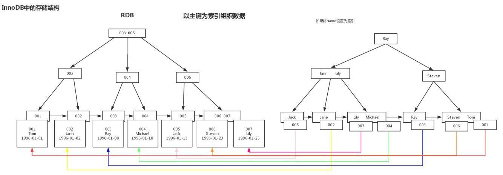
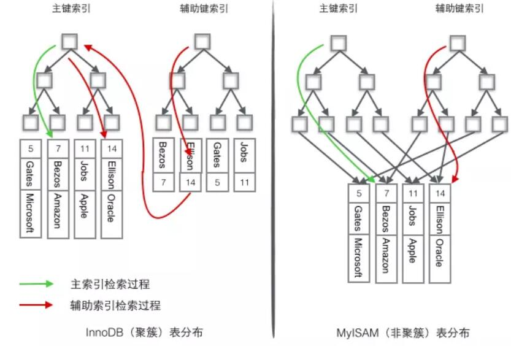
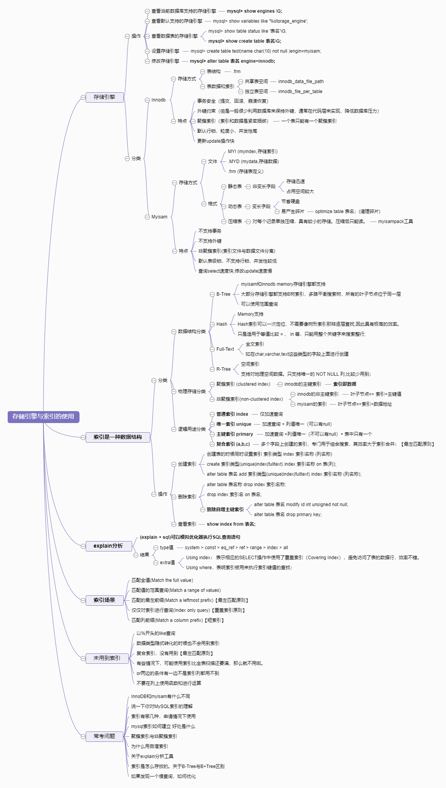

# 3 存储引擎与索引的使用

> &emsp;&emsp; **数据库索引是一个数据结构`(A database index is a data structure)`**,索引是基于存储引擎的，一般都支持Btree索引。
> 说到小时候用的汉语字典，你会想到目录查询；同样的，牵扯到数据库，那么索引`(Index)`就是快速查询的关键。其改善了数据检索操作的速度，数据库表以额外写入和存储空间的费用来维持索引数据结构。好处是使用索引可以**快速定位数据**，而不必每次访问数据库表时都在数据库表中搜索每一行。


***
<p align="right">-***Tacks [^NAME]***</p>
[^NAME]: This is my Sign! My name is `Tao A`, email is `tacks321@qq.com` <br/>
If you find any mistakes , you can contact me!

<p align="right"><sup>2019/10/11 Firday</sup></p>

## 目录
<!-- MarkdownTOC autolink="true" autoanchor="true" -->

- [1、存储引擎\(Storage Engine\)](#1%E3%80%81%E5%AD%98%E5%82%A8%E5%BC%95%E6%93%8Estorage-engine)
    - [1.1 概念](#11-%E6%A6%82%E5%BF%B5)
    - [1.2 查看引擎](#12-%E6%9F%A5%E7%9C%8B%E5%BC%95%E6%93%8E)
    - [1.3 设置引擎](#13-%E8%AE%BE%E7%BD%AE%E5%BC%95%E6%93%8E)
    - [1.4 引擎类型](#14-%E5%BC%95%E6%93%8E%E7%B1%BB%E5%9E%8B)
        - [【Innodb】](#%E3%80%90innodb%E3%80%91)
        - [【Myisam】](#%E3%80%90myisam%E3%80%91)
        - [【Innodb与Myisam特性区别】](#%E3%80%90innodb%E4%B8%8Emyisam%E7%89%B9%E6%80%A7%E5%8C%BA%E5%88%AB%E3%80%91)
- [2、索引\(Index\)](#2%E3%80%81%E7%B4%A2%E5%BC%95index)
    - [2.1 概念](#21-%E6%A6%82%E5%BF%B5)
    - [2.2 分类](#22-%E5%88%86%E7%B1%BB)
        - [2.2.1 按照数据结构](#221-%E6%8C%89%E7%85%A7%E6%95%B0%E6%8D%AE%E7%BB%93%E6%9E%84)
        - [2.2.2 按照物理存储](#222-%E6%8C%89%E7%85%A7%E7%89%A9%E7%90%86%E5%AD%98%E5%82%A8)
        - [2.2.3 按照应用逻辑](#223-%E6%8C%89%E7%85%A7%E5%BA%94%E7%94%A8%E9%80%BB%E8%BE%91)
    - [2.3 索引实现](#23-%E7%B4%A2%E5%BC%95%E5%AE%9E%E7%8E%B0)
        - [2.3.1 创建索引](#231-%E5%88%9B%E5%BB%BA%E7%B4%A2%E5%BC%95)
        - [2.3.2 删除索引](#232-%E5%88%A0%E9%99%A4%E7%B4%A2%E5%BC%95)
        - [2.3.3 查看索引](#233-%E6%9F%A5%E7%9C%8B%E7%B4%A2%E5%BC%95)
- [3、 explain分析](#3%E3%80%81-explain%E5%88%86%E6%9E%90)
    - [3.1 如何分析你的语句是否用到索引](#31-%E5%A6%82%E4%BD%95%E5%88%86%E6%9E%90%E4%BD%A0%E7%9A%84%E8%AF%AD%E5%8F%A5%E6%98%AF%E5%90%A6%E7%94%A8%E5%88%B0%E7%B4%A2%E5%BC%95)
    - [3.2 使用到索引场景](#32-%E4%BD%BF%E7%94%A8%E5%88%B0%E7%B4%A2%E5%BC%95%E5%9C%BA%E6%99%AF)
    - [3.3 未使用到索引](#33-%E6%9C%AA%E4%BD%BF%E7%94%A8%E5%88%B0%E7%B4%A2%E5%BC%95)
    - [3.4 设计索引原则](#34-%E8%AE%BE%E8%AE%A1%E7%B4%A2%E5%BC%95%E5%8E%9F%E5%88%99)
- [4. 参考资料](#4-%E5%8F%82%E8%80%83%E8%B5%84%E6%96%99)
- [5. 打个总结](#5-%E6%89%93%E4%B8%AA%E6%80%BB%E7%BB%93)

<!-- /MarkdownTOC -->

<a id="1%E3%80%81%E5%AD%98%E5%82%A8%E5%BC%95%E6%93%8Estorage-engine"></a>
### 1、存储引擎(Storage Engine)

&emsp;&emsp;首先我们要对存储引擎有一个大致的了解，索引也是基于存储引擎的，不同的存储引擎默认使用的索引也不太一样。MySQL提供有多种存储引擎，Myisam 、Innodb 、BDB 、Memory 、Merge、Archive 、Federated、CSV、Blackhole等。例如`Myisam`和`Innodb`的存储引擎创建的索引是**BTree**索引，而`Memory`默认使用的则是**Hash**索引。

<a id="11-%E6%A6%82%E5%BF%B5"></a>
#### 1.1 概念

&emsp;&emsp;存储引擎是表示数据的存储结构。不同于其他数据库，**插件式存储引擎**是MySQL数据库的核心特性之一。这种架构设计可以让MySQL的数据用各种不同的存储引擎来存储到文件或者内存中。每个存储引擎有着不同的**存储方法、索引类型、锁机制**等。它可以很灵活的来选择，根据实际业务，从而找到合适的存储引擎来改善整体功能。


&emsp;&emsp;关于存储引擎，MySQL最开始只有ISAM引擎，后来进行了扩展与重构，将业务逻辑与数据存储的层次拆分开来，所以有了存储引擎Myisam的概念。在MySQL5.1，插件式的存储引擎体系架构出现，让存储引擎加载非常灵活，并且使SQL层与存储引擎层的耦合更小。MySQL5.5.5 之后，**InnoDB成为默认存储引擎**，处理巨大数据量时的最大性能设计。

<a id="12-%E6%9F%A5%E7%9C%8B%E5%BC%95%E6%93%8E"></a>
#### 1.2 查看引擎

- (1) 查看当前数据库支持的存储引擎
    + 命令：`mysql> show engines \G;`
    + 结果：MySQL5.7.26支持9中存储引擎
    + 说明：
```
          Engine(引擎): InnoDB
         Support(支持): DEFAULT(默认值)
         Comment(描述): Supports transactions, row-level locking, and foreign keys(支持事务，行级锁，外键)
    Transactions(事务): YES
              XA(XA事务): YES
      Savepoints(事务逻辑点): YES(支持保存savepoints之间的内容)
```

- (2) 查看默认支持存储引擎
    + 命令：`mysql> show variables like '%storage_engine';`
    + 说明： mysql5.5之后默认都是InnoDB存储引擎。
```
mysql> show variables like '%storage_engine';
+----------------------------------+--------+
| Variable_name                    | Value  |
+----------------------------------+--------+
| default_storage_engine           | InnoDB |
| default_tmp_storage_engine       | InnoDB |
| internal_tmp_disk_storage_engine | InnoDB |
+----------------------------------+--------+
```

- (3) 查看数据表的存储索引类型
    + 命令1：`mysql> show table status like 'category'\G;`可以看表的状态
    + 说明：可以在输出中看到Engine中对应表的存储引擎。
    ```
            mysql> show table status like 'category'\G;
    *************************** 1. row ***************************
               Name(表名): category
             Engine(引擎): InnoDB
            Version(版本): 10
         Row_format(行格式): Dynamic（动态行 一般包含可变长的字段）
               Rows(行数): 3(对于非事务性表（MyISAM），这个值是精确的，对于事务性引擎（InnoDB）这个值通常是估算的)
     Avg_row_length(平均每行包含的字节数): 5461字节
        Data_length(整个表的数据量): 16384字节
    Max_data_length(表可以容纳的最大数据量): 0
       Index_length(索引占用磁盘的空间大小): 0
          Data_free(data_free 表示共享表空间的大小而非数据的大小;如果是独享表空间才是该表的剩余空间): 0
     Auto_increment(自增值): 4（下一个 Auto_increment 的值）
        Create_time(表的创建时间): 2019-10-07 14:42:10
        Update_time(表的最近修改时间): 2019-10-07 14:42:09
         Check_time(最近检查表时间): NULL(使用 check table 命令 或 myisamchk 工具)
          Collation(字符集): utf8_general_ci
           Checksum(校验和): NULL(如果启用，保存的是整个表的实时校验和)
     Create_options(指表创建时的其他所有选项):
            Comment(其他额外信息):
    1 row in set (0.00 sec)
    ```

    + 命令2：`mysql> show create table category\G;`可以看建表语句
    + 说明：通过建表语句来查看 表使用的存储引擎。
        ```
               Table: category
        Create Table: CREATE TABLE `category` (
          `id` int(11) unsigned NOT NULL AUTO_INCREMENT COMMENT '栏目id',
          `name` varchar(60) NOT NULL DEFAULT '' COMMENT '栏目名称',
          `time` timestamp NOT NULL DEFAULT CURRENT_TIMESTAMP,
          PRIMARY KEY (`id`)
        ) ENGINE=InnoDB AUTO_INCREMENT=4 DEFAULT CHARSET=utf8
        ```


<a id="13-%E8%AE%BE%E7%BD%AE%E5%BC%95%E6%93%8E"></a>
#### 1.3 设置引擎

- 在创建表的时候可以利用engine=myisam直接指定；
    + 例如：`mysql> create table test(name char(10) not null )engin=myisam;`
- 如果修改表引擎的话，可以利用alter table 表名 engine=myisam；
    + 例如：`mysql> alter table category engine=innodb;`

<a id="14-%E5%BC%95%E6%93%8E%E7%B1%BB%E5%9E%8B"></a>
#### 1.4 引擎类型


<a id="%E3%80%90innodb%E3%80%91"></a>
##### 【Innodb】

+ 存储方式
    * 共享表空间存储：
        - 表结构保存在`.frm`
        - 索引和数据在`innodb_data_home_dir`和`innodb_data_file_path`定义的表空间中
        - 如果我们不在My.cnf文件中指定`innodb_data_home_dir`和`innodb_data_file_path`那么默认会在datadir目录下创建ibdata1 作为innodb tablespace。
        - 优点：
            + 可以将表空间分成多个文件存放到各个磁盘上，一个表可以分布在不同的文件；
        - 缺点：
            + 多个表及索引在表空间中混合存储，这样对于一个表做了大量删除操作后表空间中将会有大量的空隙；
        ```
        //默认值
            mysql> show variables like 'innodb_data%';
            +-----------------------+------------------------+
            | Variable_name         | Value                  |
            +-----------------------+------------------------+
            | innodb_data_file_path | ibdata1:12M:autoextend |[ibdata1大小初始大小12M,可以增加文件大小]
            | innodb_data_home_dir  |                        |[默认就在/var/lib/mysql下]
            +-----------------------+------------------------+
        //如果想修改的话，再my.cnf中修改，可以设置多个共享表空间文件分担
        [mysqld]
        innodb_data_file_path = ibdata1:12M;ibdata2:1G:autoextend
        ```

    * 独立表空间存储
        - 表结构存储在`.frm`；
        - 配置文件增加`innodb_file_per_table`参数可以修改InnoDB为独立表空间模式，每个数据库的每个表都会生成一个数据空间。
        - 每个表的数据和索引单独存储在`.ibd`中。设置`innodb_file_per_table`。
        - 优点 ：
            + 每个表都有自已独立的表空间来存放数据和索引；
            + Drop table操作自动回收表空间；
            + 对于使用独立表空间的表，不管怎么删除，表空间的碎片不会太严重的影响性能，而且还有机会处理。
        - 缺点：
            + 数据过大，单表增加过大；
        ```
        //默认开启
        mysql> show variables like 'innodb_file_per_table';
        +-----------------------+-------+
        | Variable_name         | Value |
        +-----------------------+-------+
        | innodb_file_per_table | ON    |
        +-----------------------+-------+
        ```

<a id="%E3%80%90myisam%E3%80%91"></a>
##### 【Myisam】

+ 存储方式
    * 三个文件:文件名和表名一致。扩展名分别是 `.frm (存储表定义).MYD (MyData,存储数据).MYI (MyIndex,存储索引)`。
    * 存储数据和索引的文件可以分别放置不同的目录Data Directory 和 Index Directory， 平均分布IO，提高更快的速度。
+ 存储格式
    * 静态（固定长度）表；
        - 定义：默认存储格式，表中字段都是非变长字段，也就是都固定长度,最简单也是最安全的。
        - 优点：
            + **存储迅速**；
            + 当按照索引中的行号查找一个行时，用行长度乘以行号；
            + 便于修复,崩溃后容易重建，因为记录位于固定位置。
        - 缺点：
            + **占用空间较大**，因为它会按照列的宽度定义，不满的话补充空格，不过读取时候看不到。
            + 但是也有可能是本身我就需要尾部有个空格，它也会自动帮我们删除，不符合预期。失去空格。
    * 动态表；
        - 定义：表中包含变长字段，不是固定长度。
        - 优点：
            + 占用空间相对较少，以要存储的实际长度来存储，在不超过列定义的最大范围内。
            + **节省磁盘**;
        - 缺点：
            + 由于表的更新或者删除记录，因为不是按照固定长度排列的，**易产生碎片**。
            + 出现问题不容易重构；
        - 整理碎片：可以使用`optimize table`或者`myisamchk -r`来进行改善性能，减少碎片空间。
        ```
             mysql> optimize table news_nav;
                +--------------------+----------+----------+----------+
                | Table              | Op       | Msg_type | Msg_text |
                +--------------------+----------+----------+----------+
                | nyistnews.news_nav | optimize | status   | OK       |
                +--------------------+----------+----------+----------+
        ```
    * 压缩表；
        - 通过`myisampack`工具进行创建，对每个记录单独压缩，具有较小的存储,压缩后只能读。
        - 优点：非常小的访问开支
        - 缺点：但是读取数据有需要进行解压，也是比较耗费。

<a id="%E3%80%90innodb%E4%B8%8Emyisam%E7%89%B9%E6%80%A7%E5%8C%BA%E5%88%AB%E3%80%91"></a>
##### 【Innodb与Myisam特性区别】

+ Innodb特点
    * InnoDB支持**事务安全**（提交、回滚、崩溃恢复）
    * InnoDB支持**外键约束**（但是一般很少利用数据库来保持外键，通常在代码层来实现，降低数据库压力）
    * InnoDB表是基于**聚簇索引**；聚簇索引对主键的查询有很高的性能；
        - 叶子节点的数据域，存放的就是实际的数据记录。一个表只能有一个聚簇索引。
        - InnoDB的索引和数据是紧密捆绑的,没有使用压缩,一般来说文件比较大。
    * InooDB表默认支持**Btree索引**,底层实现B+Tree
        - 对于频繁访问的表，Innodb会在B树索引基础上建立hash索引，可以显著提高查找效率，对于客户端是透明的；
        - **主键索引**，**叶子节点**存储索引和 **数据**，非叶子节点可以存放更多的key;
        - **辅助索引**，**叶子结点**存储的并不是数据的地址，是**主索引的值**，遍历的时候先找到主键索引，再找数据；
    * InnoDB**默认行锁，粒度小，并发性高**。
        - InnoDB 表的行锁也不是绝对的，
        - 如果在执行一个 SQL语句时，MySQL 不能确定要扫描的范围，InnoDB 表同样会锁全表，
        - 例如 `update table set num=1 where name like '%aaa%'`。
    * **更新update操作快；**
    * InnoDB 中不保存表的具体行数;执行`select count(*) from table`时，InnoDB要扫描一遍整个表来计算有多少行;
    * 一定会有**主键**
        - 如果我们定义了**主键索引(`primary key`)**，那么InnoDB会选择主键作为聚集索引；
        - 如果没有显式定义主键，则InnoDB会选择第一个不包含有NULL值的**唯一索引(unique)**作为主键索引；
        - 如果也没有这样的唯一索引，则InnoDB会选择内置6字节长的**rowid**作为隐含的聚集索引
        - 但最好还是一开始就设置一个自动增长的主键。
    * 自动增长列(auto_increment)；
        - 可以手动插入，但是如果插入的是0或者null(一般插入null),则实际插入的是自动增长后的值。
        - 最好同时设置主键是自动增长的；
            + 两种主键效率较好；
                1. **自己设置自增整型主键**，这时候写入顺序是自增的，和B+数叶子节点分裂顺序一致；
                2. **不要设置主键，同时没有唯一索引**，用innodb隐藏的自增主键rowid,写入顺序和ROWID增长顺序一致；
            + 表使用自增主键，
                - 插入新的记录，记录就会顺序添加到当前索引节点的后续位置，当一页写满，就会自动开辟一个新的页;
                - InnoDB表的数据写入顺序能和B+树索引的叶子节点顺序一致，这时候存取效率是最高的;
            + 使用非自增主键
                - 每次插入主键的值近似于随机,因此每次新纪录都要被插到现有索引页得中间某个位置;
                - 此时MySQL不得不为了将新记录插到合适位置而移动数据;
                - 甚至目标页面可能已经被回写到磁盘上而从缓存中清掉，此时又要从磁盘上读回来;
                - 增加了很多开销，同时频繁的移动、分页操作造成了大量的碎片，得到了不够紧凑的索引结构;
                - 后续不得不通过`optimize table`来重建表并优化填充页面。
        - 获取自增ID
            + **获取当前线程最后插入记录的使用的值`select LAST_INSERT_ID();`**
            + 如果一次插入多条记录，那么`select LAST_INSERT_ID();`获取的是第一次记录返回的增长值。
        - 删除过数据
            + InnoDB 表只是把自增主键的最大 ID 记录到内存中；
            + 所以重启数据库会导致最大 ID 丢失，然后它会看当前数据中最大的ID+1。
            + 例如数据库中有id，1、2、3的记录，那么如果删除3，然后重启数据库，再插入一行新数据，ID=3;
+ Myisam特点
    * **不支持事务**
    * **不支持外键**
    * **默认表级锁，不支持行锁，并发性较低**。读取时对表加上共享锁，在写入是对表加上排他锁；不适合高并发操作。
        - 查询select速度快;
        - 修改update速度慢；
    * MyISAM是基于**非聚簇索引**(索引文件与数据文件分离)进行存储的；
    * MyISAM默认支持BTree索引
    * MyISAM的索引和数据是分开的,而且索引是压缩的；
    * 允许没有主键的表存在。
    * MyISAM中保存表的具体行数，内置了一个计数器，count(*)时它直接从计数器中读。
    * 自动增长列(auto_increment)，如果设置啦自动增长；
        - 如果删除过数据，因为 MyISAM 表会把自增主键的最大ID记录到数据文件里，重启MySQL自增主键的最大ID也不会丢失。
        - 例如数据库中有id，1、2、3的记录，那么如果删除3，然后重启数据库，再插入一行新数据，ID=4;


<br/>
<br/>
<br/>
&emsp;&emsp;&emsp;&emsp;&emsp;&emsp;**MySQL插件式的存储引擎**，可以根据不同特性选用最适合的提高应用的效率。

|  存储引擎   |  特点 |
|  ----  | ----  |
| **InnoDB**  |  **插入更新速度快**。**事务型**，支持ACID事务，默认 **行级锁定**。并发性高。**Btree索引**，聚簇索引|
| **MyISAM**  | 插入，**查询速度高**，但不支持事务。**表锁**，并发性低。**Btree索引**，非聚簇索引|
| BDB  | 源自Berkeley DB，事务型数据库的另一种选择，支持COMMIT和ROLLBACK等其他事务特性 |
| Memory   | 所有数据置于内存的存储引擎，增删改查都很快。其内容会在Mysql重新启动时丢失。 **Hash索引**|
| Merge   | 将一定数量的MyISAM表联合而成一个整体，在超大规模数据存储时很有用 |
| Archive   |拥有高效的插入速度，但其对查询的支持相对较差。非常适合存储大量的独立的，作为历史记录的数据|
| Federated  |  将不同的Mysql服务器联合起来，逻辑上组成一个完整的数据库。非常适合分布式应用 |
| CSV  |  逻辑上由逗号分割数据，每个表一个.csv文件，每个数据行占用一个文本行。CSV存储引擎不支持索引 |
| BlackHole   |  黑洞引擎，写入的任何数据都会消失，一般用于记录binlog做复制的中继 |


<a id="2%E3%80%81%E7%B4%A2%E5%BC%95index"></a>
### 2、索引(Index)

<a id="21-%E6%A6%82%E5%BF%B5"></a>
#### 2.1 概念

&emsp;&emsp;**索引（Index）**是帮助MySQL高效获取数据的**数据结构**。通过对表相关列创建索引，并在检索的时候正确使用索引列，进而提高select查询操作性能。

- 所有的MySQL列类型能被索引,一个表最多可有16个索引。最大索引长度是256个字节;
- 索引是按照特定的数据结构把数据表中的数据放在索引文件中；
- 优点：
    + **大大加快数据检索select的速度；**
    + 减少分组group by或者排序order by字句花费的时间；
    + 帮助服务器避免排序和临时表。将随机 I/O 变顺序 I/O；
- 缺点：
    + **索引存在于磁盘中，会占据物理空间；**
    + 当对表数据进行增删改的时候，索引也需要进行响应的维护，降低了数据操作的速度；


<a id="22-%E5%88%86%E7%B1%BB"></a>
#### 2.2 分类

<a id="221-%E6%8C%89%E7%85%A7%E6%95%B0%E6%8D%AE%E7%BB%93%E6%9E%84"></a>
##### 2.2.1 按照数据结构

1. **BTree索引**
    - `myisam`、`innodb`、 `memory`等绝大多数存储引擎支持，而且B树也是**MySQL默认的索引**；
    - 使用`show index from table;`看到的索引名称`index_type`是BTree，但底层实现用**B+Tree数据结构**；
    - 对于频繁访问的表，**innodb**会透明建立自适应hash索引，在B树索引基础上建立hash索引，可以显著提高查找效率
    - 技术实现：
        + 这里主要说一下 Btree、B-tree、B+Tree；
        + Btree与B-tree是一个意思，都是B+Tree是B-Tree的改进版本;
            + B-Tree 和 B+Tree 区别在于，B+ Tree 在叶子节点上增加了顺序访问指针，数据全部在叶子节点中。
            + B-Tree能加快数据的访问速度，不用全表扫描来获取数据，**索引和数据分布在各个节点(叶子+非叶子)**之中。
            + B+Tree的**数据只在叶子节点**上，并且增加了**顺序访问指针**，每个叶子节点都指向相邻的叶子节点的地址;
            + B+Tree中中间节点不存储数据，因此B+Tree能够在同样大小的节点中，**存储更多的key，提高查找效率**；
        + 为啥用B+tree
            + B+tree更擅长范围查询，叶子节点与数据是按顺序放置的双向链表； 而Btree范围查询只能中序遍历。
            + B+tree的数据都集中在叶子节点,分支节点只负责索引。
            + Btree的分支节点也有数据, B+tree的层高会小于Btree，平均的Io次数会远大于B+tree;
        + 影响MySQL查找性能的主要还是磁盘IO次数，大部分是磁头移动到指定磁道的时间花费；
    - 特点
        + 可以使用范围查询，例如>、< 、>= 、<= 等；
        + 但是开头不能是通配符例如 like "%aa"，这样不会用到索引；
2. **Hash索引**
    - Memory支持;
    - 基于**哈希表**实现，只有精确匹配索引所有列的查询才有效；
        + 存储引擎都会对所有的索引列计算一个**哈希码（hash code）**
        + 然后将哈希码存储在索引中，同时在索引表中保存指向每个数据行的**指针**。
    - 可以**一次定位**，不需要像树形索引那样逐层查找,因此具有极高的效率；
    - **只是适用于等值比较** = 、 in 等，只能用整个关键字来搜索整行;
        + 由于Hash索引中存放的是经过Hash计算处理后的hash code，只能使用等值比较，不能基于范围过滤。
    - 优化器不能使用hash索引来优化排序(order by);
        + 索引中的 hash code 是顺序存储的，但是 hash code 对应的数据并不是顺序的，所以无法用于排序；
    - Hash索引不能利用到复合索引查询；
        + Hash 索引在计算 Hash 值的时候是复合索引键合并后再一起计算 Hash 值，不是计算单独的hash，所以利用复合索引左边的索引查询，无法用到hash索引。
    - 如果遇到该列的大量数据的hash code相等，那么使用hash索引的性能会下降；
        + 哈希冲突严重的话，索引维护操作的代价也很高；
        + 如果哈希冲突严重时，必须遍历链表中所有行指针；
3. Full-Text(全文索引)
    - 用于全文搜索，例如在char,varchar,text这些类型的字段上面进行创建。
    - 为了解决`where name like "%word%"`这类针对文本的模糊查询效率较低的问题。
4. R-Tree(空间索引)
    - 支持对地理空间数据。只支持唯一的 NOT NULL 列;比较少用到；


<a id="222-%E6%8C%89%E7%85%A7%E7%89%A9%E7%90%86%E5%AD%98%E5%82%A8"></a>
##### 2.2.2 按照物理存储
关于聚簇索引与非聚簇索引，**只有innodb的主键索引是聚簇的**，因为只有它，索引即数据；其他的基本上是非聚簇的；

1. 聚簇索引  (clustered index)
    - 数据行和相邻的键值存储在一起，简单的说，就是**叶子节点中存储的实际是真实的数据**；
    - 只有`InnoDB`通过主键聚集数据，所以一个表只能有一个聚簇索引，一定是`innodb`主键；
        - 将主键组织到一棵B+树中，而行数据就储存在叶子节点上；
        - 若使用"where id = 14"这样的根据主键id来进行查找数据；
        - 按照B+树的检索算法即可查找到对应的叶节点，之后获得行数据。



2. 非聚簇索引(non-clustered index)
    - 将数据存储于索引分开结构，索引结构的**叶子节点指向了数据的地址**；
    - 分两种：一种是Innodb的非主键索引；另一种式Myisam的索引；
    - **Innodb的非主键(辅助)索引，叶子节点只存储索引和主键值；**
        + 对普通索引name列进行条件搜索，需要两步走；
        + 第一步在辅助索引B+树中检索name，到达其叶子节点获取对应的主键值；
        + 第二步使用主键在主索引B+树种再执行一次B+树检索操作；
        + 最终到达叶子节点即可获取整行数据。
    - **Myisam的主键或者非主键(辅助)索引，基本一致，都是叶子节点存储索引和数据地址；**
        + 主键索引B+树的节点存储了主键，辅助键索引B+树存储了辅助键；
        + 表数据存储在独立的地方，这两颗B+树的叶子节点都使用一个地址指向真正的表数据；
        + 其检索算法：先按照B+Tree的检索算法检索，找到指定关键字，则取出对应数据域的地址，再去找到数据；
        + 也就是说这两种是独立的，通过辅助键检索无需访问主键的索引树。


3. 两者区别
    - 在访问速度上，聚簇索引比非聚簇索引快；
        + 聚簇索引的索引树的叶子节点的**直接指向要查找的数据行**。
        + 非聚簇索引每次都要经过两次B+树查找，先**查询一遍索引文件，得到数据地址，跟据索引获取数据**；
    - 文件存放，主要是索引和数据是不是放在一起的；
        + Myisam索引myi文件和数据myd文件是分开存储；
        + Innodb是索引和数据是一起以idb文件的形式进行存储；




<a id="223-%E6%8C%89%E7%85%A7%E5%BA%94%E7%94%A8%E9%80%BB%E8%BE%91"></a>
##### 2.2.3 按照应用逻辑

1. 普通索引：仅加速查询；
2. 唯一索引：加速查询 + **列值唯一**（可以有null）；
3. 主键索引：加速查询 + **列值唯一（不可以有null）**+ **表中只有一个**；
4. 复合索引：多个字段上创建的索引，专门用于组合搜索，其效率大于索引合并；【最左匹配原则】
5. 全文索引：对文本的内容进行分词，进行搜索；
6. 索引覆盖：select的数据列只用从索引中就能够取得，不必读取数据行，换句话说查询列要被所建的索引覆盖；
7. 索引合并：使用多个单列索引组合搜索；
8. 空间索引：空间数据spatial类型字段并且非空not null上建立的索引，有geometry、point、linestring、polygon，很少用;

<a id="23-%E7%B4%A2%E5%BC%95%E5%AE%9E%E7%8E%B0"></a>
#### 2.3 索引实现

<a id="231-%E5%88%9B%E5%BB%BA%E7%B4%A2%E5%BC%95"></a>
##### 2.3.1 创建索引
- ①可以在创建表的时候
    + 格式**`索引类型 index 索引名称 (列名称)`**
    ```
    create table index_student1(
        sid int unsigned not null auto_increment comment '自增id',
        xing   char(10)     not null default ''  comment '姓',
        ming   char(10)     not null default ''  comment '名',
        sno    char(10)     not null default ''  comment '学号',
        sinfo  text comment '个人介绍',
        primary  key              (sid),
        unique   index unique_sno (sno),
        index          index_name (xing,ming),
        fulltext index full_sinfo (sinfo)
    )engine=myisam charset=utf8;
    ```
- ②可以利用create进行索引创建
    + 格式 **`create  索引类型(unique|index|fulltext) index 索引名称 on 表(列);`**
    ```
        create table index_student2(
        sid    int unsigned not null comment 'sid',
        xing   char(10)     not null default '' comment '姓',
        ming   char(10)     not null default '' comment '名',
        sno    char(10)     not null default '' comment '学号',
        sinfo  text comment '个人介绍'
    )engine=myisam charset=utf8;

    create unique  index   unique_sno   on index_student3(sno);
    create index           index_name   on index_student3(xing,ming);
    create fulltext index  full_sinfo   on index_student3(sinfo);
    ```
- ③可以利用alter table来增加索引
    + 格式 **`alter table table_name add 索引类型(unique|index|fulltext) index 索引名称 (列名称);`**
    ```
    create table index_student3(
        sid    int unsigned not null comment 'sid',
        xing   char(10)     not null default '' comment '姓',
        ming   char(10)     not null default '' comment '名',
        sno    char(10)     not null default '' comment '学号',
        sinfo  text comment '个人介绍'
    )engine=myisam charset=utf8;
    alter table index_student2
            add primary key    (sid),
            add unique  index  unique_sno  (sno),
            add index          index_name  (xing,ming),
            add fulltext index full_sinfo  (sinfo);
    ```

<a id="232-%E5%88%A0%E9%99%A4%E7%B4%A2%E5%BC%95"></a>
##### 2.3.2 删除索引

+ 对于自增主键 先去除自增 再删除主键
    + ①：`alter table 表名 modify id int unsigned not null;`
    + ②：`alter table 表名 drop primary key;`
+ 其他索引
    * `alter table 表名称 drop index 索引名称;`
    * **`drop index  索引名 on 表名;`**
    * 例如：`alter table index_student1 drop index unique_sno ;`

<a id="233-%E6%9F%A5%E7%9C%8B%E7%B4%A2%E5%BC%95"></a>
##### 2.3.3 查看索引

* `mysql> show index from 表名;`
    * 例如
    ```
               mysql> show index from article\G;
    ****************************** 1. row ****************************
            Table: article      【表名称】
       Non_unique: 0            【索引是否可以包括重复值，0不可以，1可以】
         Key_name: PRIMARY      【索引的名称】
     Seq_in_index: 1            【索引中的列序列号 从1开始】
      Column_name: id           【索引列的名称】
        Collation: A            【列以什么方式存储在索引中，A升序，Null无分类】
      Cardinality: 3            【索引中唯一值的数目的估计值 】
         Sub_part: NULL         【Sub_part 如果列只是被部分地编入索引，则为被编入索引的字符的数目
                                如果整列被编入索引，则为NULL】
           Packed: NULL         【Packed 指示关键字如何被压缩。如果没有被压缩，则为NULL】
             Null:              【Null 如果列含有NULL，则含有YES。如果没有，则该列含有No】
       Index_type: BTREE        【Index_type 用过的索引方法（BTREE, FULLTEXT, HASH, RTREE）】
          Comment:              【Comment 多种评注描述】
    Index_comment:
    1 row in set (0.00 sec)
    ```


<a id="3%E3%80%81-explain%E5%88%86%E6%9E%90"></a>
### 3、 explain分析

<a id="31-%E5%A6%82%E4%BD%95%E5%88%86%E6%9E%90%E4%BD%A0%E7%9A%84%E8%AF%AD%E5%8F%A5%E6%98%AF%E5%90%A6%E7%94%A8%E5%88%B0%E7%B4%A2%E5%BC%95"></a>
#### 3.1 如何分析你的语句是否用到索引

&emsp;&emsp;**explain**使用`explain`关键字可以模拟优化器执行SQL查询语句，从而知道MySQL是如何处理的SQL语句的,发现是否合理使用索引以及表的读取顺序，表有多少行被优化器查询等。

用法： explain + sql
```
mysql> explain select art_title from news_article where art_title='【周分享】'\G;
*************************** 1. row ***************************
           id: 1
  select_type: SIMPLE
        table: news_article
   partitions: NULL
         type: ALL
possible_keys: NULL
          key: NULL
      key_len: NULL
          ref: NULL
         rows: 61
     filtered: 10.00
        Extra: Using where
1 row in set, 1 warning (0.00 sec)
```

解析：

- id
    + 查询的序列号，包含一组数字;
    + Mysql会按照id从大到小的顺序执行query，在id相同的情况下，则从上到下执行。
- select_type
    + **simple**:简单select查询，查询中不包含子查询或者union
    + **primary**:查询中包含任何复杂的子部分，最外层查询则被标记为primary
    + **subquery**：在select或where列表中包含了子查询
    + derived：在FROM中包含的子查询被标记为deriver(衍生)， MySQL会递归执行这些子查询，把结果放到临时表中
    + union：若第二个SELECT出现UNION，则被标记为UNION, 若UNION包含在FROM子句的子查询中，外层子查询将被标记为derived
    + union result：从UNION表获取结果的SELECT
- table
    + 输出的行所引用的表。
- **type**
    + type显示的是访问类型，是较为重要的一个指标。
    + 从好到差`system > const > eq_ref > ref > range > index > all`
    + system：表只有一行记录（等于系统表）很少出现
    + **const**：常量 如果通过索引依次就找到了，const用于比较**主键索引或者unique索引**。 因为只能匹配一行数据，所以很快。
    + **eq_ref**：唯一性索引扫描，对于每个索引键，表中只有一条记录与之匹配。常见于**主键或唯一索引扫描**；
    + **ref**：非唯一性索引扫描，返回匹配某个单独值的所有行。它返回所有匹配 某个单独值的行，然而它可能会找到多个符合条件的行，所以它应该属于查找和扫描的混合体
    + **range**：只检索给定范围的行，使用一个索引来选择行。key列显示使用了哪个索引，一般就是在你的where语句中出现between、<、>、in等的查询，这种范围扫描索引比全表扫描要好。
    + **index**：Full Index Scan ，index与ALL的区别为index类型只遍历索引树，这通常比ALL快，因为索引文件通常比数据文件小；虽然ALL和index都是读全表， 但index是从索引中读取的，而ALL是从硬盘读取的
    + all：Full Table Scan，遍历全表获得匹配的行
- possible_keys
    + 显示可能应用在这张表中的索引，一个或多个。 查询涉及到的字段上若存在索引，则该索引将被列出，但不一定被查询实际使用；
- key
    + 实际使用的索引。如果为NULL，则没有使用索引。
    + 查询中若出现了覆盖索引，则该索引仅出现在key列表中。
- key_len
    + 显示的值为索引字段的最大可能长度，并非实际使用长度，即key_len是根据表定义计算而得；精度越高值越大；
- ref
    + 显示索引的哪一列被使用了，哪些列或常量被用于查找索引列上的值。
- rows
    + 根据表统计信息及索引选用情况，大致估算出找到所需记录多需要读取的行数。
- extra
    + Using filesort：说明MySQL会对数据使用一个外部的索引排序，而不是按照表内的索引顺序进行读取。MySQL中无法利用索引完成的排序操作称为“文件排序”，效率很低；
    + Using temporary：  使用了临时表保存中间结果，MySQL在对查询结果排序时使用临时表。常见于排序order by和分组查询group by
    + **Using index**： 表示相应的SELECT操作中使用了覆盖索引（Covering Index），避免访问了表的数据行，效率不错。
    + Using where，表明索引被用来执行索引键值的查找；
    + impossible where： where子句的值总是false，不能用来获取任何元组。
    + distinct： 优化distinct操作，在找到第一匹配的元祖后即停止找同样值的操作。

<a id="32-%E4%BD%BF%E7%94%A8%E5%88%B0%E7%B4%A2%E5%BC%95%E5%9C%BA%E6%99%AF"></a>
#### 3.2 使用到索引场景

1. 匹配全值(Match the full value)
    - 对索引中所有的列都指定具体值，也就是等值匹配。
    - type=const
2. 匹配值的范围查询(Match a range of values)
    - 对索引的值能够进行范围查找。索引最多用于一个范围列，如果查询条件中有两个范围列则无法全用到索引。
    - type=range
3. 匹配的最左前缀(Match a leftmost prefix)**【最左匹配原则】**
    - 针对复合索引，要有最左匹配原则。idx_abc(a,b,c)  在查询中，需要从左a，利用到索引的查询。
    - type=ref
4. 仅仅对索引进行查询(Index only query)**【覆盖索引原则】**
    - 针对索引进行查询，查询的列也是在索引字段中，查询的条件也是索引，比较高效。
    - type=ref  extra:Using index 直接访问到数据，也就是索引即数据，不需要回表操作。
5. 匹配列前缀(Match a column prefix)【短索引】
    - 针对索引字段的前N个字符创建索引；比如前10个字节；
    - 对字段的前几个字符设置索引，可以缩小索引文件的大小；
    - order by排序 或者 group by分组 的时候无法使用；
    - type=range
6. ICP(Index Condition Pushdown 某些情况下将过滤放到存储引擎来做)
    - 优化器 根据where条件中的索引列 过滤索引，然后再push 再索引上过滤某个字段。
    - type=ref extra:Using index condition

<a id="33-%E6%9C%AA%E4%BD%BF%E7%94%A8%E5%88%B0%E7%B4%A2%E5%BC%95"></a>
#### 3.3 未使用到索引

1. **以%开头的like查询**
    - 前导模糊查询不能使用索引，非前导查询可以。
    - 可以考虑使用全文索引来解决。fulltext
    - 也可以利用innodb的索引特点，一般索引比表要小，扫描索引也是比扫描表更快
        + innodb上建立二级索引， idx_last_name 索引，包含(索引last_name 和 主键 actor_id)
        + 那么理想的方式，就是先去扫描二级索引得到满足的%name%的actor_id列表 以后，再去回表查询。
        + 避免了全表扫描actor产生的大量的IO请求。
2. **数据类型隐式转化**的时候也不会用到索引
    - 当查询条件左右两侧类型不匹配的时候会发生强制转换，强制转换可能导致索引失效而进行全表扫描。
    - 例如：如果该列column是char类型，那么where条件中就不要用column=int来用整数判断；
        + `select * from user where phone=12345678901;`应该给phone上加引号，作为字符串比对；
3. 复合索引，**没有用到【最左匹配原则】**
    - 最左匹配原则：在where条件中一定要先使用左边的列进行比较；
4. 有些情况下，可能使用索引比全表扫描还要满，那么就不用啦。
    - MySQL生成的执行计划会进行判断，如果使用索引筛选的rows记录不多的话，就不用索引。
5. **or只有一边列有索引，不会用上索引**
    - 两边的条件都要是索引列，才能用到。
6. **索引列做运算或者使用函数。**
    - 不要在索引列上使用函数，这将导致索引失效而进行全表扫描。
    - 例如`select * from article where YEAR(create_time) <= '2019';`
    - 即使建立了索引，也会全表扫描，可以把计算放到业务层，这样做不仅可以节省数据库的 CPU，还可以起到查询缓存优化效果。
7. 使用**负向条件**的查询不能用到索引
    - 负向条件有：!=、<>、not in、not exists、not like 等。
    - `select * from article where status != 1 and status != 2; `可以转为正向的 in来改善


<a id="34-%E8%AE%BE%E8%AE%A1%E7%B4%A2%E5%BC%95%E5%8E%9F%E5%88%99"></a>
#### 3.4 设计索引原则

优化索引，从而优化整个sql语句的查询效率。

1. 尽量是用到索引列。
    - 应尽量避免全表扫描，考虑在 where 及 orderby,group by 涉及的列上建立索引。
    - 两个表的连接字段应该创建索引。
2. 使用**唯一索引**
    - 考虑列的值分布，索引基数越大，创建索引区分开效果也越好。例如身份证id。但是你要在性别sex上创建唯一就没有意义，因为它总是各一半。
    - 区分度可以使用 count (distinct (列名))/count (*) 来计算，大概 80% 以上的时候就可以建立索引。
3. 使用**短索引/前缀索引**
    - 例如对字符串列进行索引，可以指定一个前缀长度，例如char(100)。如果在前面20个字节的都是唯一的，那么就不需要对整个列进行索引
    - 这样节省了索引空间，可以在索引高速缓冲中容纳更多的键值。另外对于较小的索引，设计的磁盘IO也比较少，所以查询起来也会快一些。
4. 利用**最左前缀原则**
    - 创建一个n个列的索引，实际上是创建了可利用的n个索引，多个索引可以起到多个作用，但是where查询中，必须要从左边的列进行条件过滤。
5. 不能过度创建索引
    - 索引的创建，需要占用额外的空间，会降低写操作的性能，修改表内容的时候，同时索引也会进行更新。
    - MySQL的执行计划，也是在考虑选用最好的索引，如果多的话，也会影响查询优化的时间。所以只需要保留所需的即可。


<a id="4-%E5%8F%82%E8%80%83%E8%B5%84%E6%96%99"></a>
### 4. 参考资料
如有侵权，请及时与我联系，我将删除本文中参考资料的链接；

- [说一下你对MySQL索引的理解]
    -  https://mp.weixin.qq.com/s/M6i5nzXT93-zupIiiNOq0g
- [聚簇索引与非聚簇索引]
    -  https://www.jianshu.com/p/fa8192853184
- [关于B-Tree与B+Tree区别]
    - https://www.jianshu.com/p/f635a6a94254
    - https://www.cnblogs.com/liqiangchn/p/9060521.html
    - https://segmentfault.com/a/1190000004690721
- [为什么用自增索引]
    - https://www.jianshu.com/p/d6a22e0d3a49
- [关于explain分析工具]
    - https://blog.csdn.net/jobschen/article/details/50878854

<a id="5-%E6%89%93%E4%B8%AA%E6%80%BB%E7%BB%93"></a>
### 5. 打个总结



